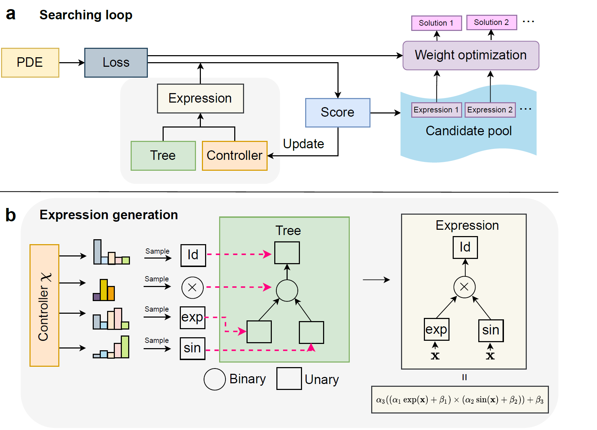

# Finite-expression-method


By [Senwei Liang](https://leungsamwai.github.io) and [Haizhao Yang](https://haizhaoyang.github.io/)

This repo is the implementation of "Finite Expression Method for Solving High-Dimensional Partial Differential Equations" [[paper]](https://arxiv.org/abs/2206.10121).

## Introduction

Finite expression method (FEX) is a new methodology that seeks an approximate PDE solution in the space of functions with finitely many analytic expressions. This repo provides a deep reinforcement learning method to implement FEX for various high-dimensional PDEs in different dimensions.



## Environment
* [PyTorch 1.0](http://pytorch.org/)

## Code structure

```
Finite-expression-method
│   README.md    <-- You are here
│
└─── fex    ----> three numerical examples with FEX
│   │   Poisson
│   │   Schrodinger
│   │   Conservationlaw
│   
└─── nn     ----> three numerical examples with NN
    │   Poisson
    │   Schrodinger
    │   Conservationlaw
```
## Citing FEX
If you find our code is helpful for your research, please kindly cite
```
@article{liang2022finite,
  title={Finite Expression Method for Solving High-Dimensional Partial Differential Equations},
  author={Liang, Senwei and Yang, Haizhao},
  journal={arXiv preprint arXiv:2206.10121},
  year={2022}
}
```
## Acknowledgments

We appreciate [bearpaw](https://github.com/bearpaw) for his [DL framework](https://github.com/bearpaw/pytorch-classification) and Taehoon Kim for his [RL fromework](https://github.com/carpedm20/ENAS-pytorch).