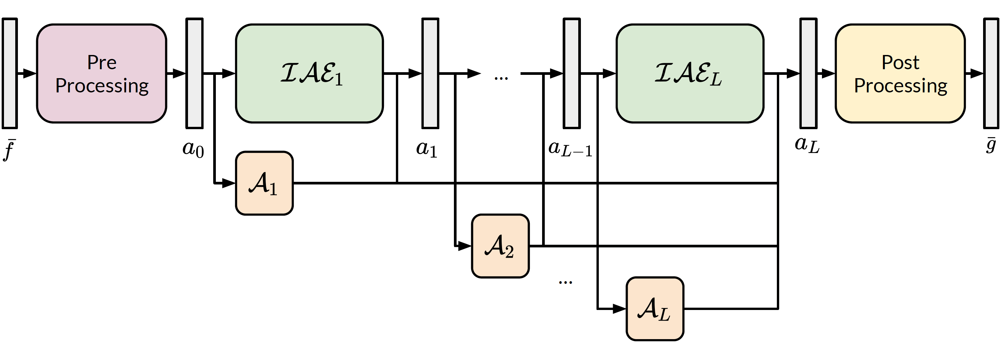

# IAE-Net: Integral Autoencoders for Discretization-Invariant Learning

By Yong Zheng Ong, Zuowei Shen and Haizhao Yang

This repository contains the code used for the implementation of the paper:
- [IAE-Net: Integral Autoencoders for Discretization-Invariant Learning](https://arxiv.org/abs/2203.05142)



## Requirements
- Python 3.7.11, PyTorch 1.6.0

## Dataset Generation and Training Procedure

The prepared dataset is placed in the corresponding `data` folder in the `datasets` directory. For e.g., darcy dataset is placed in `datasets/darcy/data`. The next few sections describe how to generate the data and run the training for each of the experiments.

### Burgers Dataset

The burgers dataset is generated via the data generation code found in https://github.com/zongyi-li/fourier_neural_operator/tree/master/data_generation. A copy is found in `datasets/burgers/data_generation/gen_burgers.m`. Move the generated file to `datasets/burgers/data`. Please refer to https://arxiv.org/abs/2203.05142 for the settings used to generate the dataset.

Training is done using the command

```
python train.py iae_net burgers multi
```

### Darcy Dataset

The burgers dataset is generated via the data generation code found in https://github.com/zongyi-li/fourier_neural_operator/tree/master/data_generation. A copy is found in `datasets/darcy/data_generation/gen_darcy.m`. Move the generated file to `datasets/darcy/data`. Please refer to https://arxiv.org/abs/2203.05142 for the settings used to generate the dataset.

Training is done using the command

```
python train.py iae_net darcy multi
```

### Scattering Dataset

The code to generate the scattering dataset is obtained from the authors of
- https://arxiv.org/abs/1810.09675

A sample dataset is found in the following [link](https://drive.google.com/file/d/1ZstDV0fQSzqYYfaiPMgS52BKJibmbpdW/view?usp=sharing). Move the downloaded file to `datasets/scattering/data`. Training is done using the command

Inverse Problem:
```
python train.py iae_net inverse_scattering multi
```

Forward Problem:
```
python train.py iae_net scattering multi
```

### Ellipses Dataset

The code to generate the ellipses dataset is obtained from
- https://github.com/adler-j/learned_gradient_tomography
- https://github.com/odlgroup/odl

The data generation code is provided in `datasets/ellipses/data_generation/odl_data.py`. Move the generated files to `datasets/ellipses/data`.

Training is done using the command

```
python train.py iae_net ellipses multi
```

### Fecgsyndb Dataset

The dataset is obtained from 
- https://physionet.org/content/fecgsyndb/1.0.0/

The data generation code is provided in `datasets/fecgsyndb/build_dataset.py`. To run the code, place the downloaded fecgsyndb dataset from https://physionet.org/content/fecgsyndb/1.0.0/ in the `fecgsyndb` folder, then run `python build_dataset.py`. The end result should give a file `fecgsyndb.mat` in `datasets/fecgsyndb/data` folder.

Training is done using the command

```
python train.py iae_net fecgsyndb multi
```

## Training

The code can be run using `train.py`, following the below command

```
python train.py iae_net DATASETNAME LOADTYPE
```

- DATASETNAME denotes the problem, following the folder name on `datasets` folder
- LOADTYPE denotes the training style, `default` refers to no DA, `multi` refers to IAE-Net, and `multi3` applies to the scattering problem for multiple datasets training.

## Credits

The following sources have contributed greatly to the development of this repository: 
- FNO implementation, burgers and darcy dataset: https://github.com/zongyi-li/fourier_neural_operator
- Scattering Dataset: https://arxiv.org/abs/1810.09675
- Ellipses Dataset: https://github.com/adler-j/learned_gradient_tomography, https://github.com/odlgroup/odl
- Fecgsyndb Dataset: https://physionet.org/content/fecgsyndb/1.0.0/

## Citations

```
@misc{ong2022iaenet,
      title={IAE-Net: Integral Autoencoders for Discretization-Invariant Learning}, 
      author={Yong Zheng Ong and Zuowei Shen and Haizhao Yang},
      year={2022},
      eprint={2203.05142},
      archivePrefix={arXiv},
      primaryClass={cs.LG}
}
```
